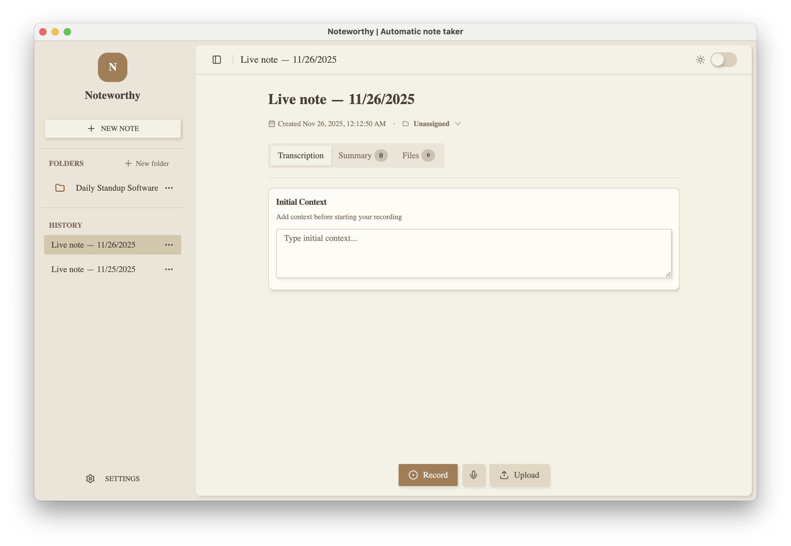

# Noteworthy — Automatic Notes

Noteworthy is a beautiful Electron desktop note taker that pipes both microphone and system audio into OpenAI's Realtime transcription API. Start a live note, capture human + computer voices at once, jot manual highlights, and export everything with a couple of clicks. Notes live locally on your machine; no accounts, sync services, or surprise uploads.




## Highlights

- **Dual-source capture** – stream microphone input and looped-back system audio into the same note so every voice and clip is searchable.
- **Live transcripts** – entries are stamped with timestamps and source badges (Microphone vs System audio) so you always know where context came from.
- **Lightweight note hub** – organise sessions, search history, add free-form highlights, archive finished notes, and clear old archives when you want a clean slate.
- **Local-first storage** – notes are saved in the renderer's local storage; nothing leaves your device unless you export it.
- **One-click exports** – generate Markdown summaries or print-ready PDFs directly from the desktop app.
- **Backup recording** – optional combined WAV recorder for redundancy.
- **Upcoming** – Offline capture via `whisper.cpp` so you can transcribe without an internet connection.
- **Localized controls** – set a default transcription language (ships with Bahasa Indonesia) and add an optional context prompt before audio is uploaded.
- **Folder organization** – group recordings into named folders with tags/colors and reusable context/summary defaults so each process starts with the right template.

## Prerequisites

- macOS, Windows, or Linux
- Node.js v16+
- OpenAI API key with access to the Realtime API (set `OPENAI_KEY` in `.env`)
- Microphone + permission to capture system audio (screen/audio capture prompts will appear on first run)

## Getting Started

```bash
npm install
npm start  # runs `vite build` before launching Electron
```

For faster UI iteration you can run `npm run dev` to start the Vite dev server while you work on the renderer bundle.

1. Create a `.env` in the project root:
   ```ini
   OPENAI_KEY=sk-...
   ```
2. Run `npm start` to launch the Electron window.
3. Click **New Live Note**, give it a name, then press **Start capture**.
4. Grant microphone and screen/audio capture permissions when prompted.
5. Watch transcript entries stream in with clear labels for microphone or system audio. Add your own highlights in the editor panel as you go.
6. Export to Markdown or PDF whenever you need to share the record.

## Controls & Panels

- **Capture controls** – start/stop streaming, choose transcription model, select your input microphone, and trigger the optional backup recorder.
- **Transcription preferences** – switch language and provide a context prompt.
- **Status pills** – see at a glance whether microphone, system audio, and recording channels are live.
- **Live transcript** – rolling feed of entries. Draft badges show when the model is listening or processing before the final text lands in the note.
- **Highlights** – freeform contenteditable area for action items or context.
- **Housekeeping** – archive a note when it is done, then clear archived notes in bulk from the sidebar.
- **Folders** – create folders with tags/colors/default context and summary prompts; the folder list sits above history, and selecting a folder scopes the note list with a Back control.

## Exporting

- **Markdown** – produces a `.md` file with timestamps, source labels, and highlights (converted to plain text).
- **PDF** – opens a print preview; choose *Save as PDF* to download a styled snapshot of the note.

## Development Notes

- Project entry points now live in `main.js` (Electron main), `preload.js`, and the React renderer under `src/renderer`.
- The renderer is bundled with Vite/Tailwind, renders from `src/renderer/index.jsx`, and ships the app shell + UI helpers stored in `src/renderer/components/ui` (build output lands in `dist/`). Theme tokens follow the Tweakcn export format, so refresh the `:root`, `.dark`, and `@theme inline` blocks in `src/renderer/styles.css` with the CSS snippet you get from https://github.com/jnsahaj/tweakcn or https://tweakcn.com when you tweak the palette.
- Run `npm run build:renderer` to produce a fresh renderer bundle before `npm start`, or use `npm run dev` for the Vite dev server while prototyping.
- Audio loopback is provided by [`electron-audio-loopback`](https://github.com/alectrocute/electron-audio-loopback).
- Tests are not configured yet. Add `jest` or `mocha` if you contribute automated coverage.

## Packaging

- Install dependencies (`npm install`) and make sure a valid `OPENAI_KEY` lives in `.env`; the packaging step picks up whatever credentials exist locally.
- Run `npm run dist` to rebuild the renderer and run `electron-builder` for whatever platform you are on. Platform-specific helpers (`npm run dist:mac`, `npm run dist:win`, `npm run dist:linux`) rebuild the renderer and run the matching target explicitly (`DMG/ZIP`, `NSIS/ZIP`, or `AppImage`), so use them when you want to override the default behavior (macOS hosts already produce signed DMG + ZIP). Windows builds on macOS require Wine/mono layers, so install those before running `npm run dist:win`.
- Find all of the outputs in `release/Noteworthy-<version>.*` (e.g., `.dmg`, `.zip`, `.exe`, `.AppImage`) and share the packages with the respective platform users. The release directory is overwritten on each build, so archive artifacts if you need to store them long term.

## Roadmap & Ideas

- Offline speech-to-text via `whisper.cpp` (UI already surfaces the teaser badge).
- Multi-track export and advanced search/tagging.
- Workspace sync once local-first workflows feel mature.

Pull requests are welcome—keep them focused and follow Conventional Commit messaging (e.g. `feat(notes): add note color tags`).
